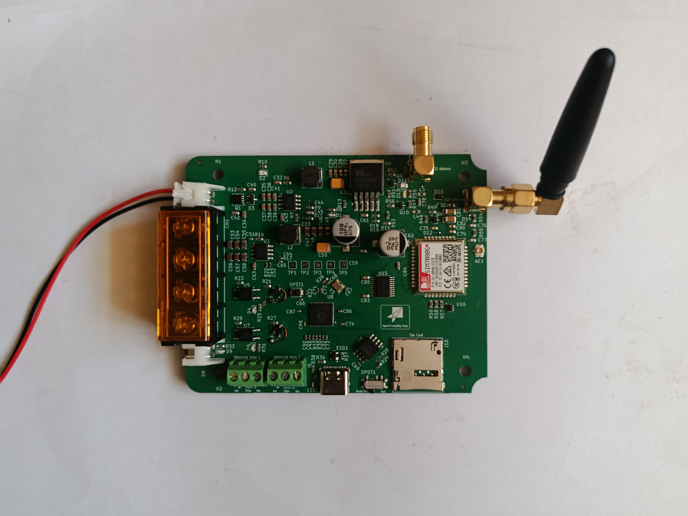

# pico-modem



A minimal implementation for interfacing Raspberry Pi Pico (RP2040) with cellular modems via AT commands over UART. This project demonstrates direct modem communication without high-level framework abstractions, providing full visibility into the cellular connection process.

**Development Status:** In progress

## Overview

This project showcases:
- Direct AT command communication with cellular modems
- SIM card detection and validation
- Network registration monitoring
- Modem information extraction (IMEI, ICCID, IMSI, signal strength, etc.)
- Visual status feedback via LED patterns
- Minimal UART configuration for reliable serial communication

The implementation prioritizes clarity and educational value, making it suitable for learning cellular modem fundamentals and adapting to other platforms.

## Hardware Requirements

- **Microcontroller:** Raspberry Pi Pico (RP2040-based board)
- **Modem Module:** SIM7080G Cat-M/NB-IoT modem (or similar AT command-compatible modem)
- **SIM Card:** Standard Micro-SIM with active data plan
- **LED:** (Optional) For visual status indication
- **USB Cable:** For power, programming, and serial console output

### Wiring

Connect the Raspberry Pi Pico to your modem module as follows:

```
Raspberry Pi Pico          SIM7080G Modem
─────────────────────────────────────────
GPIO 0 (UART0 TX)    →     RX
GPIO 1 (UART0 RX)    →     TX
GPIO 2               →     PWR_EN (Power control)
GPIO 23              →     LED+ (Status indicator)
GND                  →     GND
3.3V                 →     VCC
```

**Notes:**
- Ensure the modem operates at 3.3V logic levels (RP2040 is 3.3V compatible)
- If your modem requires higher voltage for power, use appropriate power supply but maintain 3.3V logic levels for UART
- The LED connection is optional; without it, monitor status via USB serial console

## Getting Started

### Prerequisites

This project requires the Raspberry Pi Pico SDK to build. Before proceeding, please follow the official Pico SDK documentation to install and set up the SDK on your system:

**Official Pico SDK Setup Guide:** https://www.raspberrypi.com/documentation/microcontrollers/c_sdk.html#sdk-setup

### Setting Up the Project

Once you have the Pico SDK installed, you can build this project from anywhere on your computer by setting the `PICO_SDK_PATH` environment variable to point to your SDK installation.

#### Option 1: Set PICO_SDK_PATH environment variable

```bash
export PICO_SDK_PATH=/path/to/pico-sdk
```

Add this line to your shell configuration file (e.g., `~/.bashrc`, `~/.zshrc`) to make it permanent.

#### Option 2: Pass PICO_SDK_PATH to CMake directly

```bash
cmake -DPICO_SDK_PATH=/path/to/pico-sdk -B build
```

### Building

Once the SDK path is configured:

```bash
mkdir build
cd build
cmake ..
make
```

The built `.uf2` file will be ready to flash to your Raspberry Pi Pico.

### Flashing the Firmware

1. Hold the **BOOTSEL** button on the Raspberry Pi Pico while connecting it to your computer via USB
2. The Pico will appear as a USB mass storage device (drive name: `RPI-RP2`)
3. Copy `build/pico-modem.uf2` to the mounted drive
4. The Pico will automatically reboot and start running the firmware

## Configuration

Edit [`config.h`](config.h) to match your hardware setup:

```c
// UART Pin Configuration
#define PIN_UART_TX             0    // GPIO 0 - UART TX to modem RX
#define PIN_UART_RX             1    // GPIO 1 - UART RX from modem TX
#define MODEM_UART              uart0

// Modem Control
#define PIN_MODEM_PWR           2    // GPIO 2 - Modem power enable

// Status LED
#define LED_PIN                 23   // GPIO 23 - Status indicator

// Network Configuration
#define NETWORK_APN             "safaricom"  // Change to your carrier's APN

// UART Buffer
#define UART_BUFFER_SIZE        1024         // Receive buffer size
```

**Important:** Update `NETWORK_APN` to match your mobile carrier:

| Carrier (Example) | APN |
|-------------------|-----|
| Safaricom (Kenya) | `safaricom` |


Consult your carrier's documentation for the correct APN.

## Usage

### Connecting to Serial Console

The firmware outputs debug information via USB serial. Connect using your preferred serial terminal:

**Linux/macOS:**
```bash
screen /dev/ttyACM0 115200
# or
minicom -D /dev/ttyACM0 -b 115200
```

**Windows:**
Use PuTTY, TeraTerm, or the Arduino Serial Monitor:
- Port: COMx (check Device Manager)
- Baud rate: 115200

### LED Status Indicators

The firmware uses different LED blink patterns to indicate system state:

| Pattern | Meaning | System State |
|---------|---------|--------------|
| 3 quick blinks | Startup initiated | Initialization |
| 2 medium blinks | Modem powered on | Modem ready |
| 1 blink every 2s | SIM ready | Normal operation |
| 5 blinks every 2s | SIM not ready | Warning - check SIM |
| 10 rapid blinks (repeating) | Modem boot failed | Error - check connections |

### Expected Output

Successful initialization produces output similar to:

```
===== Pi Modem - SIM7080G Firmware =====
Build: Nov 29 2025 14:23:45

  UART initialized successfully

===== Starting Modem =====
Toggling power...
Waiting 35s for modem boot...
>>> ATE1
>>> OK
Modem ready after 35124 ms

===== Configuring Modem =====
>>> AT+CMEE=2;+CMGF=1;+CMGD=,4;+CNMP=38;+CMNB=1;+CGDCONT=1,"IP","safaricom"
>>> OK
Modem configured for Cat-M and the APN set to "safaricom"

===== Modem Info =====

Manufacturer:
>>> SIMCOM INCORPORATED

Model:
>>> SIMCOM_SIM7080G

Firmware:
>>> Revision:1351B05SIM7080G

IMEI:
>>> 867698045123456

===== Checking SIM =====
>>> AT+CPIN?
>>> +CPIN: READY
>>> OK
SIM: READY

===== SIM Info =====

ICCID:
>>> +CCID: 8925412345678901234

IMSI:
>>> 639123456789012

Phone Number:
>>> +CNUM: "","+254712345678",129

Operator:
>>> +COPS: 0,0,"Safaricom",7

Signal:
>>> +CSQ: 17,99

Registration:
>>> +CREG: 0,1

===== SIM Ready =====
```

## Troubleshooting

### Modem Doesn't Respond

**Problem:** No response to AT commands, boot timeout errors

**Solutions:**
- Verify UART wiring (TX→RX, RX→TX crossover)
- Confirm modem power supply (stable 3.3V-4.2V depending on modem)
- Check modem PWR_EN pin connection
- Ensure modem has completed 35-second boot sequence
- Test modem independently with USB-to-serial adapter

### SIM Card Not Detected

**Problem:** Output shows `SIM: NOT DETECTED` or `+CME ERROR: 10`

**Solutions:**
- Verify SIM card is fully inserted and properly oriented
- Check SIM card contacts for corrosion or debris
- Try SIM card in a mobile phone to confirm it works
- Ensure SIM is not PIN-locked (disable PIN or modify code to send PIN)
- Confirm SIM size matches modem socket (Micro-SIM vs Nano-SIM)

### Network Registration Fails

**Problem:** SIM detected but `AT+CREG?` returns `0,2` (searching) or `0,3` (denied)

**Solutions:**
- Verify carrier supports Cat-M/LTE-M in your region
- Check signal strength with `AT+CSQ` (values below 10 indicate poor signal)
- Confirm correct APN in `config.h`
- Ensure SIM has active data plan
- Try manual operator selection: `AT+COPS=1,2,"<operator-code>"`
- Verify antenna is properly connected

### Weak or No Signal

**Problem:** `AT+CSQ` returns `99,99` or very low values

**Solutions:**
- Connect or replace antenna
- Move device near window or outdoors
- Check carrier coverage maps for your area
- Verify carrier supports Cat-M (not all LTE networks include Cat-M)

### Build Errors

**Problem:** CMake or compilation fails

**Solutions:**
```bash
# Ensure PICO_SDK_PATH is set
echo $PICO_SDK_PATH

# If not set, export it
export PICO_SDK_PATH=/path/to/pico-sdk

# Update Pico SDK to latest version (minimum 2.2.0 required)
cd $PICO_SDK_PATH
git pull
git submodule update --init --recursive

# Clean and rebuild
cd /path/to/pico-modem
rm -rf build
mkdir build
cd build
cmake ..
make
```

## Project Structure

```
pico-modem/
├── config.h              # Hardware and network configuration
├── main.cpp              # Application entry point and main loop
├── driver/
│   ├── sim7080g.h       # SIM7080G driver interface
│   └── sim7080g.cpp     # SIM7080G driver implementation
├── docs/
│   └── blog/            # Technical blog post about the implementation
├── CMakeLists.txt       # Build configuration
└── README.md            # This file
```

## Adapting to Other Modems

While this implementation targets the SIM7080G, it can be adapted to other AT command-compatible modems with minimal changes:

1. **Update modem-specific commands** in `sim7080g.cpp`:
   - Configuration commands in `config_modem()`
   - Vendor-specific AT commands (if using modem-specific features)

2. **Adjust timing** if needed:
   - Boot delay in `boot_modem()` (line 51)
   - Command timeouts in various `send_at()` calls

3. **Rename files** (optional) to reflect new modem model

Most standard AT commands (`AT+CPIN?`, `AT+CREG?`, `AT+CSQ`, etc.) work identically across modems.

## Extending Functionality

This implementation provides a foundation for more advanced features:

- **HTTP/HTTPS Communication:** Use `AT+SHCONN`, `AT+SHREQ`, `AT+SHREAD`
- **MQTT:** Configure with `AT+SMCONF` and publish with `AT+SMPUB`
- **GPS/GNSS:** Enable with `AT+CGNSPWR=1` and read with `AT+CGNSINF`
- **SMS:** Send with `AT+CMGS`, receive with `AT+CMGR`
- **Power Management:** Sleep modes via `AT+CSCLK=1` and `AT+CPSMS`

See the [blog post](docs/blog/configuring-modem-with-pico.md) for detailed explanations of cellular modem concepts and AT command fundamentals.

## Related Resources

- [Blog Post: Understanding Cellular Modem Communication](docs/blog/configuring-modem-with-pico.md)
- [SIM7080G AT Command Manual](https://www.simcom.com/product/SIM7080G.html)
- [Raspberry Pi Pico Documentation](https://www.raspberrypi.com/documentation/microcontrollers/)
- [3GPP AT Command Specification (TS 27.007)](https://www.3gpp.org/DynaReport/27007.htm)


